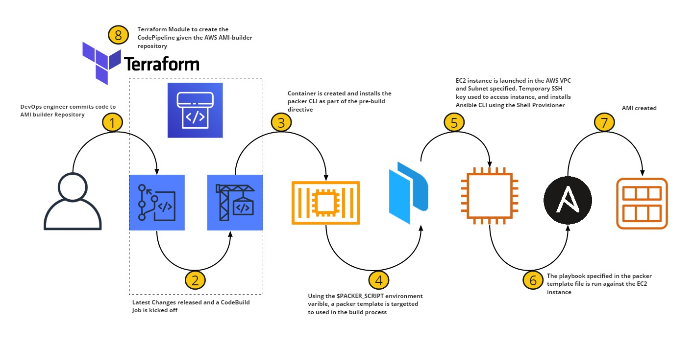

## Purpose

The purpose of this solution is to provide a means to build AMIs in a scalable, highly configurable and repeatable manner. Using Packer alonside Ansible, we're able to launch and configure EC2 instances to create AMIs, writing  our own or reusing roles from the opensource community. Using CodeCommit, CodeBuild and CodePipelines, the entire processes can be orchestrated on AWS. 





Packer launches an EC2 instance in the VPC and Subnet specificed. It attaches a temporary security group allowing SSH access using the a temporary SSH key. Using the "shell" provisioner, Ansible gets installed. Thereafter using the Ansible-Local provisioner, a specific playbooks can be run using any of the roles thats available on the repository. Once the playbook has completed the AMI will be created. 

During the pre-build, packer gets installed and validates the packer template using the ```$PACKER_SCRIPT``` environment variable to target. During the build, the respective packer template gets built. The console log gets piped into a log file, which is inspected in the post-build phase to determine the exit code of the packer build process. Should there be any errors, the CodeBuild Process will be marked to fail, but if everything passes, it will create the resulting AMI and be tagged using: the date of the build, the ID of the codebuild project, the buildnumber and who it was built by, in this case Packer. 

Using a generic build-spec to orchestrate the process, we're able to scale the solution by building pipelines for each packer template. The only configuration overhead is changing the ```$PACKER_SCRIPT``` environment variable to target the specific packer template to build from. And using the Ansible Provisioner, we're not only able to write our own roles, but use the vast community roles that have already been written. 

Source Code Structure

```bash
├── ansible
│   ├── wordpress.yaml                 <-- Ansible playbook file
│   └── roles
│       ├── common                     <-- Update and Install commmon packages
        ├── worpdress                  
├── buildspec.yml                      <-- Generic CodeBuild Spec 
├── terraform                          <-- Cloudformation to create entire pipeline
│   └── test.tf
├── packer-wordpress.json              <-- Packerfile 
```


Usage of the Terraform CodePipeline module

```ruby
module "codepipline" {
    source = "git::https://bitbucket.org/synthesis_admin/module-aws-codepipeline.git"

    project_name         = "wordpress-ami-pipeline"
    project_description  = "wordpress AMI pipeline builder using the AMI builder repository"
    artefact_bucket_name = "wordpress-ami-builder-artifact-bucket"
    
    # Name of the AMI-Builder CodeCommit Repository
    source_repository    = "ami-builder"

    # Environment Variables. PACKER_SCRIPT Required, because Build-Spec references
    # the environment variable to determine which packerfile to build from. Other 
    # variables are optional.
    environment_vars = {
      PACKER_SCRIPT  = "packer-wordpress"
      VPC_ID         = "vpc-04f99e5833c3a909b"
      SUBNET_ID      = "subnet-0e3c6194859275f16"
    }
}
```

### Additional Reading
[Packer](https://packer.io/) 

[Packer Anisble Provisioner](https://packer.io/docs/provisioners/ansible-local.html)

[CodeBuild Build-Spec](https://docs.aws.amazon.com/codebuild/latest/userguide/build-spec-ref.html)

